# Procesverslag
**Auteur:** Celine van den Bosch

Markdown cheat cheet: [Hulp bij het schrijven van Markdown](https://github.com/adam-p/markdown-here/wiki/Markdown-Cheatsheet). Nb. de standaardstructuur en de spartaanse opmaak zijn helemaal prima. Het gaat om de inhoud van je procesverslag. Besteedt de tijd voor pracht en praal aan je website.

## Bronnenlijst
1. Responsive menu: <https://codepen.io/shooft/pen/BaKGKwm/>
2. Toegankelijkheid responsive menu links: <https://codepen.io/shooft/pen/yLOdLBg/>
3. Grid voor responsiveness: <https://css-tricks.com/snippets/css/complete-guide-grid/>
4. Flexbox voor de header en het trainingsschema: <https://css-tricks.com/snippets/css/a-guide-to-flexbox/>
5. Content: <http://ballardbarbellandboxingclub.com/>
6. Frameborder embedded YouTube video: <https://stackoverflow.com/questions/26274082/the-frameborder-attribute-on-the-iframe-element-is-obsolete-use-css-instead>

## Eindgesprek (week 7/8)

Dit ging goed: 
* Na lange weg met veel drempels heb ik eindelijk uitgevogeld hoe ik grid en flexbox kan toepassen

Dit was lastig:
* Het responsive maken van de elementen in de main
* Overzicht van de code bewaren
* JavaScript toepassen..........

**Screenshot(s):**

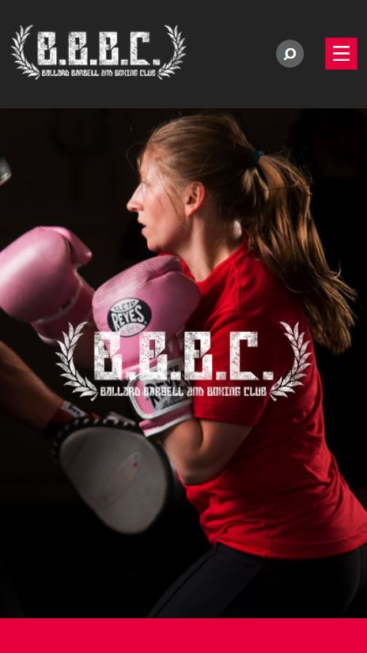
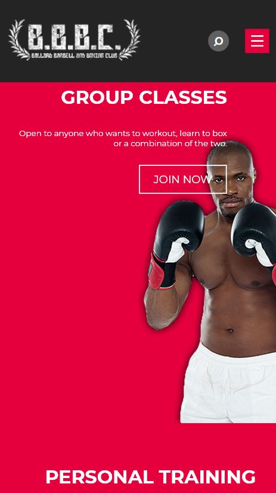
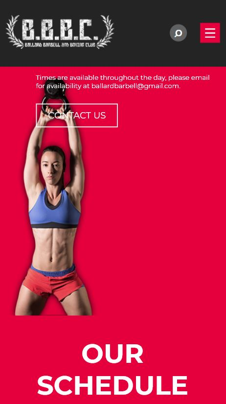
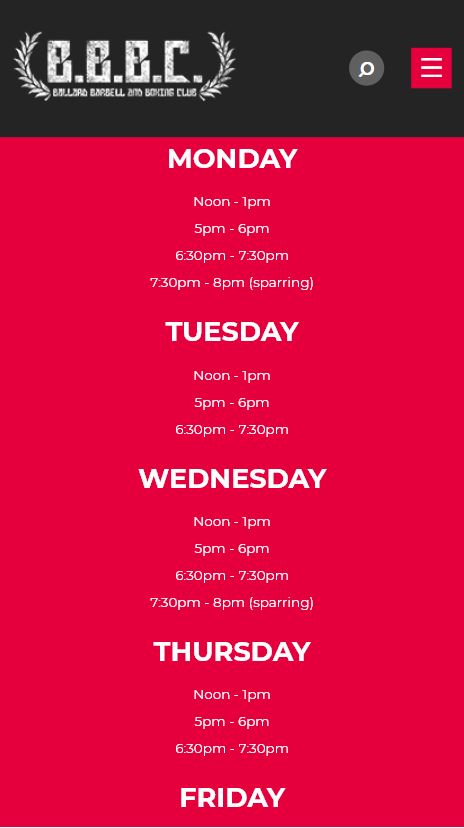
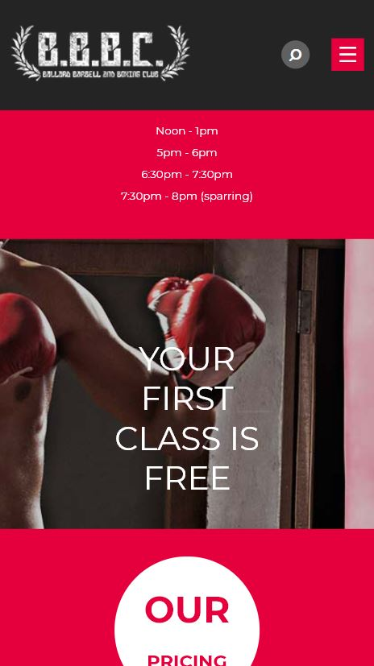
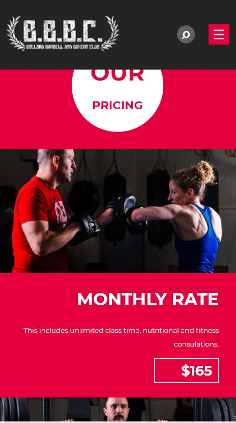
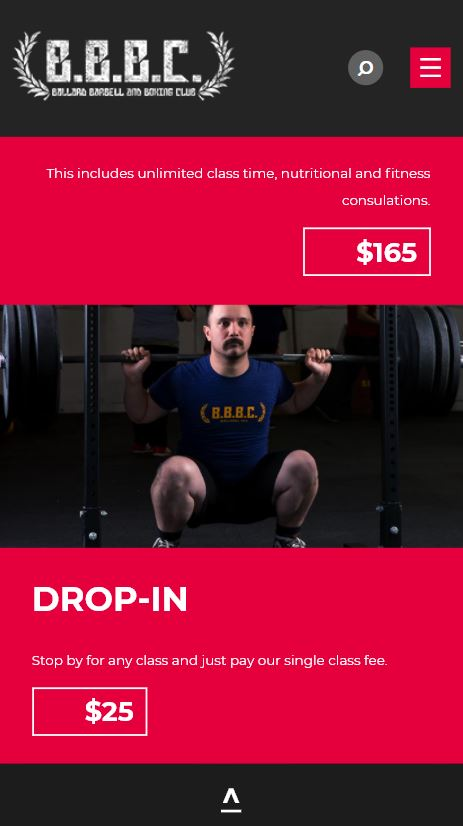
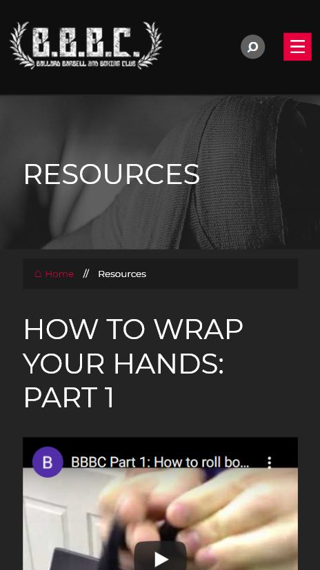
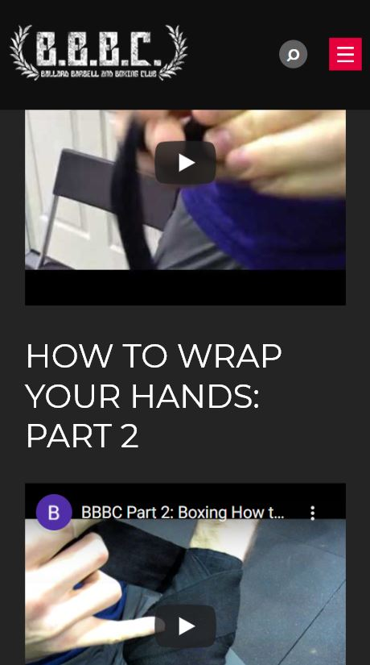
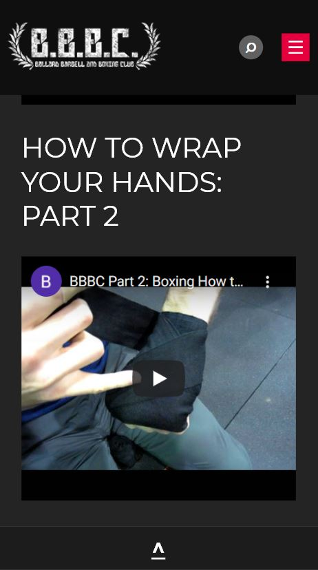
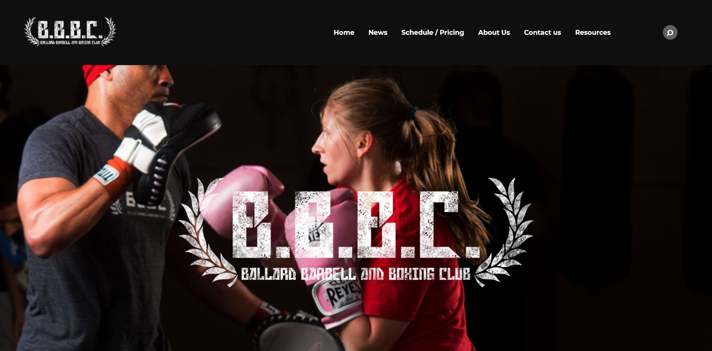
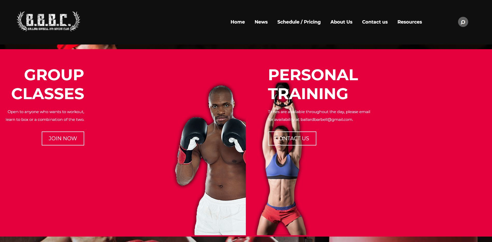
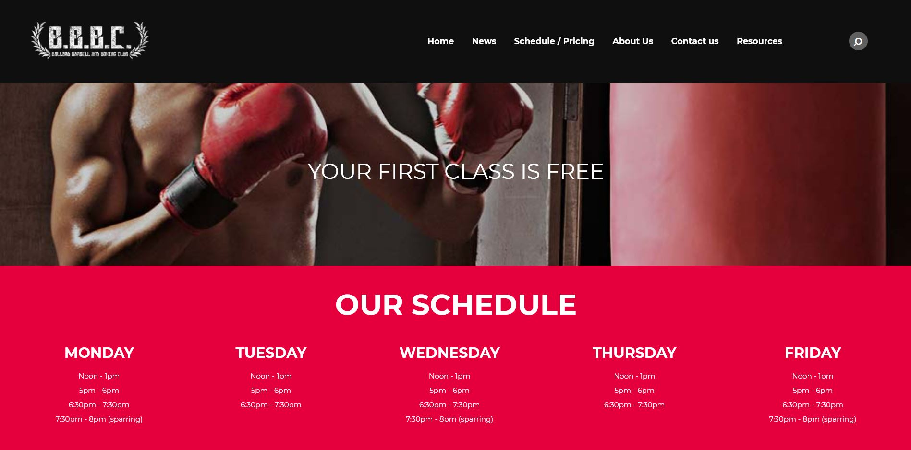
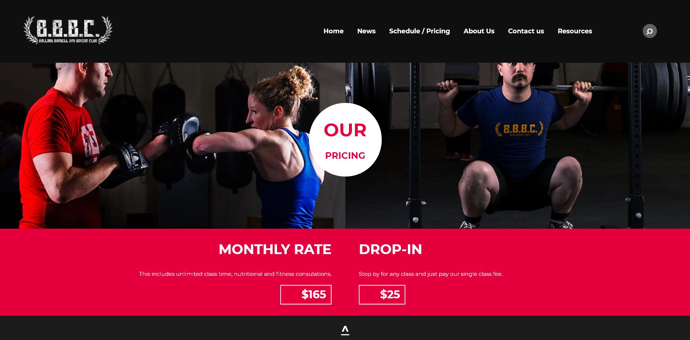
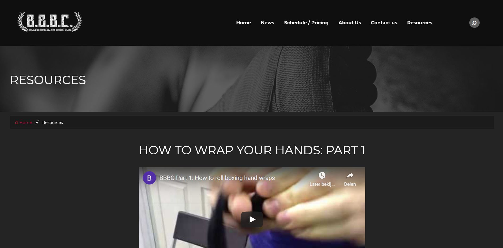
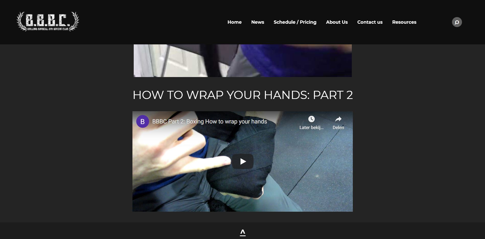

## Voortgang 3 (week 6)

### Stand van zaken

Dit ging goed: 
* HTML aangevuld
* CSS verder uitgewerkt
* Code opgeschoond (georganiseerd)
* Eindelijk de z-index gefixt

Dit was lastig:
* De drempel om meer complexiteit toe te voegen 
* Te snel blijven hangen op (nu nog) onnodige details
* Responsiveness van de elementen en afbeeldingen

**Screenshot(s):**

### Agenda voor meeting

Dingen die we behandeld willen hebben:
| Celine | Djescho | Floris |
|--------|:-------:|-------:|
| Responsiveness afbeeldingsgrootte | Hoeveel animatie moet erin zitten als je voor responsive gaat | Wat kan ik toevoegen om aan de surface plane te voldoen, want overal animaties bij maakt het niet beter |
| Zoekbalk 'pop-up' | Max width opgelost met flexbox, is this the way? | Items in een gradient op hun plek laten bij responsive |
| Responsiveness van hamburger menu icoon naar menu-items naast elkaar uigelijnd in navigatiebalk |  |  |

### Verslag van meeting

* De afbeeldingsgrootte regulieren d.m.v. max-width
* Zoekbalk pop-up d.m.v. label en input (laten oppoppen met scale)
* De responsiveness van het menu regulieren d.m.v. de menu items (zie <https://codepen.io/shooft/pen/BaKGKwm/> en <https://codepen.io/shooft/pen/yLOdLBg/>) 

## Voortgang 2 (week 5)

### Stand van zaken

Dit ging goed: 
* HTML aangevuld
* CSS iets verder uitgewerkt

Dit was lastig:
* De drempel om meer complexiteit toe te voegen
* Z-index gebruiken op een afbeelding
* Te snel blijven hangen op (nu nog) onnodige details
* Kennis toepassen (ik begrijp de stof maar ik mis motivatie om ermee te oefenen en het toe te passen)

*NB: Ik moet mijn code nog opschonen en ordenen d.m.v. comments.*

**Screenshot(s):**

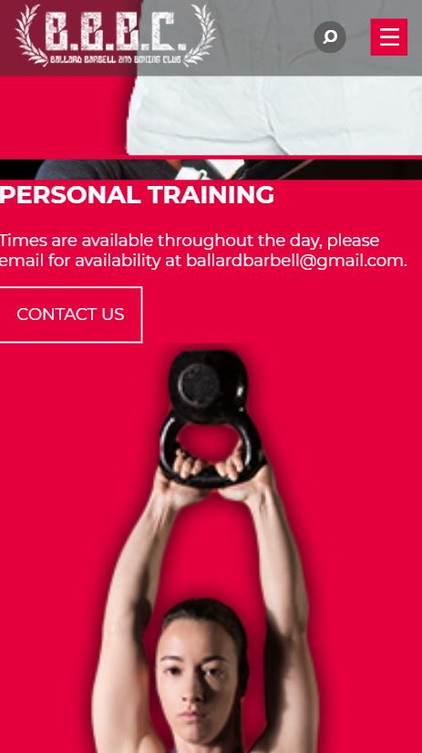

### Agenda voor meeting

Dingen die we behandeld willen hebben:
| Celine | Djescho | Floris |
|--------|:-------:|-------:|
| Afbeelding correct uitknippen / plaatsen (met z-index) op basis van schermgrootte | Ik krijg de scroll knoppen maar niet werkende :) | Wat kan ik toevoegen om aan de surface plane te voldoen, want overal animaties bij maakt het niet beter |
| Timing tekst animaties (inschuiven vanaf de zijkant tijdens het scrollen) |  |  |
| Tekst op een makkelijke manier responsive uitlijnen |  |  |
| First class is free section met meebewegende (achtergrond?) afbeelding |  |  |
| Transitie in elkaar vouwen van header en main over de hero (header begint transparant en verkleurd bij het "vouwen") |  |  |

### Verslag van meeting

* Om tekst op een afbeelding te krijgen moet je de elementen die bovenop komen position relative geven en de z-index aanpassen, en / of de afbeelding position absolute te geven en de z-index aanpassen (probeer eventueel een div om de content te zetten)
* Pas de grootte van een afbeelding aan met width %
* Background overlay door middel van z-index
* Tips om javascript toe te voegen: menu naar binnen laten schuiven en / of omdraai animatie op 'our pricing'

## Voortgang 1 (week 3)

### Stand van zaken

Dit ging goed: 
* Responsive design
* Werkgroep opdrachten

Dit was lastig:
* Beginnen
* Te snel blijven hangen op (nu nog) onnodige details
* Logo mee laten groeien / krimpen (responsiveness)
* Flexbox correct toepassen op de header

*NB: Wat betreft de opdracht loop ik een beetje achter op schema. Ik ga er morgen, vrijdag en in het weekend verder mee aan de slag.*

**Screenshot(s):**

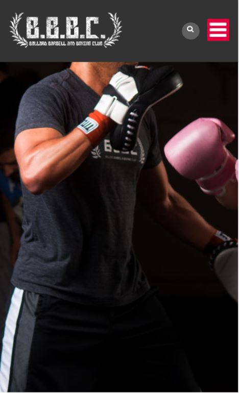

### Agenda voor meeting

Dingen die we behandeld willen hebben:
| Celine | Djescho | Floris |
|--------|:-------:|-------:|
| Transitie in elkaar vouwen van header en main over de hero | Afmetingen en responsiveness van afbeeldingen in CSS | Afmetingen en responsiveness van afbeeldingen in CSS |
| Voorgrond in sections scrolt over achtergrond foto's heen | Responsive Design Breakpoint | Lege plek |
| Header margin top moet op -15px om tegen de bovenkant te staan | Scrollen met Javascript | |
| Menu en zoek icoontje als tekst opmaken i.p.v. als afbeelding | Wel goed doen | |
| Header (responsiveness van logo en hoogte) en flexbox correct toepassen | | |

### Verslag van meeting

* Gebruik voor het plaatsen / afnsijden van images vw voor de width en overflow hidden
* Zet de margin en padding van de body op 0
* Gebruik comments om verschillende secties in CSS te creëren
* Header op fixed zetten zodat de content erachter scrolt
* Hamburger menu pictogram &#9776; is stijlbaar als tekst
* Pielen met details is oké maar niet te lang, focus eerst op het geheel daarna piel-uurtje
* Gebruik background-attachment en zet op fixed om de afbeelding op de achtergrond niet te laten mee scrollen met de content
* Voeg voor transparantie bij hex-kleuren 88 toe op het eind

## Intake (week 1)

**Je startniveau:** paars (blauw / rood)

**Je focus:** responsive

**Je opdracht:** <http://ballardbarbellandboxingclub.com/>

**Screenshot(s):**

**Breakdown-schets:**

