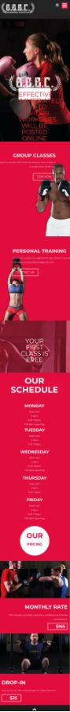

# Procesverslag
**Auteur:** Celine van den Bosch

Markdown cheat cheet: [Hulp bij het schrijven van Markdown](https://github.com/adam-p/markdown-here/wiki/Markdown-Cheatsheet). Nb. de standaardstructuur en de spartaanse opmaak zijn helemaal prima. Het gaat om de inhoud van je procesverslag. Besteedt de tijd voor pracht en praal aan je website.

## Bronnenlijst
1. -bron 1-
2. -bron 2-
3. -...-

## Eindgesprek (week 7/8)

-dit ging goed & dit was lastig-

**Screenshot(s):**

-screenshot(s) van je eindresultaat-

## Voortgang 3 (week 6)

-same as voortgang 1-

## Voortgang 2 (week 5)

-same as voortgang 1-

## Voortgang 1 (week 3)

### Stand van zaken

Dit ging goed: 
* Responsive design
* Werkgroep opdrachten

Dit was lastig:
* Beginnen
* Te snel blijven hangen op (nu nog) onnodige details
* Logo mee laten groeien / krimpen (responsiveness)
* Flexbox correct toepassen op de header

NB: Wat betreft de opdracht loop ik een beetje achter op schema. Ik ga er morgen, vrijdag en in het weekend verder mee aan de slag.

**Screenshot(s):**

-screenshot(s) van hoe ver je bent-

### Agenda voor meeting

Dingen die we behandeld willen hebben:
| Celine | Djescho | Floris |
|--------|:-------:|-------:|
| Transitie in elkaar vouwen van header en main over de hero | Afmetingen en responsiveness van afbeeldingen in CSS | Afmetingen en responsiveness van afbeeldingen in CSS |
| Voorgrond in sections scrolt over achtergrond foto's heen | Responsive Design Breakpoint | Lege plek |
| Header (responsiveness van logo en hoogte) en flexbox correct toepassen | Scrollen met Javascript | |
| Menu en zoek icoontje als tekst opmaken i.p.v. als afbeelding | Wel goed doen | |

### Verslag van meeting

| Celine | Djescho | Floris |
|--------|:-------:|-------:|
| | | | 
| | | |
| | | |
| | | |

## Intake (week 1)

**Je startniveau:** rood

**Je focus:** surface laag

**Je opdracht:** <http://ballardbarbellandboxingclub.com/>

**Screenshot(s):**

**Breakdown-schets:**

